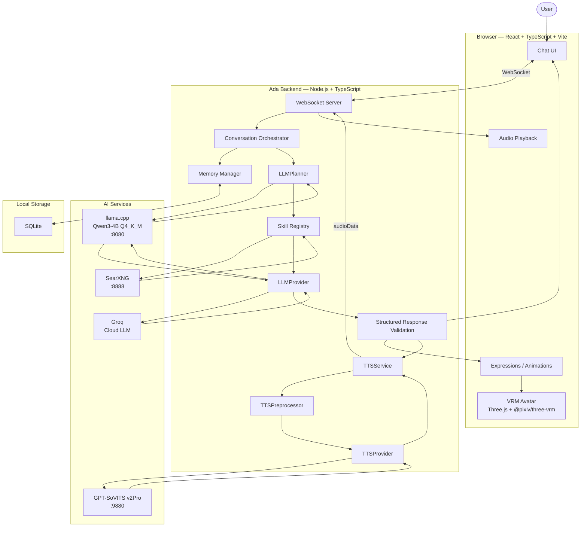

# Ada — Personal Assistant


Ada is a local-first personal AI companion presented through an anime-style VRM avatar.

The project combines a local language model, persistent memory, structured AI responses, personality, emotion-driven avatar behavior, local text-to-speech, and an LLM-driven skill system into one interactive assistant. The browser provides the visual experience while the Node.js backend coordinates conversation, memory, planning, skills, AI providers, avatar state, and voice generation.

Ada is designed around modular provider interfaces so individual AI systems can be replaced without rewriting the application.

---

## Project Overview

Ada is built around the following principles:

- **Local-first:** the core assistant and planner run locally; cloud AI is used only when a skill explicitly requires it.
- **Modular:** LLM, planner, skills, memory, and TTS capabilities are isolated behind application interfaces.
- **Interactive:** the assistant is represented by a VRM avatar rather than a text-only interface.
- **Persistent:** conversational memory is stored locally with SQLite.
- **Structured:** LLM responses contain validated application state such as text, emotion, intensity, and animation.
- **Safe by design:** future system tools are intended to use explicit interfaces, permissions, and allowlists rather than unrestricted computer access.
- **Incremental:** each major subsystem is developed independently and integrated through clear contracts.

---

# Project Phases

Ada was developed incrementally through the following phases.

## Phase 1 — Foundation

Established the core application architecture.

- React + TypeScript + Vite frontend.
- Node.js + TypeScript backend.
- Express health endpoint.
- WebSocket communication.
- Shared frontend/backend types.
- Initial chat interface.
- Repository structure and development conventions.

---

## Phase 2 — VRM Avatar

Introduced Ada's visual identity.

- Three.js rendering.
- `@pixiv/three-vrm` integration.
- VRM model loading.
- Correct avatar orientation.
- Chest-up camera framing.
- Relaxed standing pose.
- Procedural idle breathing and body movement.
- Cursor-based look-at behavior.
- Idle gaze drift.
- Collapsible chat interface.
- Collapsible developer expressions interface.

---

## Phase 3 — Local LLM

Connected Ada to a local language model.

- Local `llama.cpp` inference.
- OpenAI-compatible local API.
- Qwen3-4B Q4_K_M model.
- GPU acceleration through llama.cpp.
- Replaceable LLM provider abstraction.
- Backend conversation generation.
- No dependency on a paid hosted LLM API.

---

## Phase 4 — LLM-Driven Skills / Hybrid AI

Extended Ada from a hardcoded web-search router into an LLM-driven skill architecture.

- Local Qwen3-4B acts as the planner.
- The planner decides whether Ada should respond directly or invoke a registered skill.
- Added a generic `Skill` interface and `SkillRegistry`.
- Added `WebSearchSkill` as the first registered skill.
- Added `LLMPlanner` for structured planning decisions.
- SearXNG provides local web search.
- Groq is used as the cloud response generator when `web_search` is selected.
- Removed hardcoded web-search intent regexes from `HybridLLMRouter`.
- Added safe fallback to local Qwen if the planner, SearXNG, or Groq fails.
- Added strict privacy boundaries so SQLite memory and private conversation context are never sent to Groq for web-search requests.
- Added planner/skill latency instrumentation.
- The architecture is designed so future skills can be added through the registry without adding new routing regexes.

Current flow:

```text
User Message
     │
     ▼
Local Qwen Planner
     │
     ├── respond ───────────────► Local Qwen
     │
     └── skill: web_search
                │
                ▼
             SearXNG
                │
                ▼
               Groq
                │
                ▼
         Structured Response
                │
                ▼
        Emotion / TTS / Avatar
```

For web-search requests, the cloud model receives only the user query and search results required to answer the request. Local SQLite memory is not transmitted.

---

## Phase 5 — Personality

Turned the language model into the Ada character.

- Centralized personality configuration.
- Character identity and behavioral rules.
- Casual conversational style.
- Context-aware responses.
- Configurable personality traits.
- Separation between personality instructions and infrastructure code.

Ada's personality is treated as application configuration instead of being scattered throughout the codebase.

---

## Phase 6 — Emotion System

Connected structured AI output to the avatar.

Ada responses use validated structured data containing fields such as:

```json
{
  "text": "Example response",
  "emotion": "excited",
  "intensity": 0.85,
  "animation": "happy"
}
```

The emotion system supports:

- Neutral
- Happy
- Sad
- Angry
- Excited
- Surprised
- Curious
- Confused
- Embarrassed
- Annoyed

The backend treats emotion as application-level state, while the frontend maps that state to avatar expressions and animations.

---

## Phase 7 — Persistent Memory

Added persistent conversational memory.

- SQLite-backed local storage.
- Memory management layer.
- Conversation context retrieval.
- Persistence across application sessions.
- Separation between memory storage and conversation orchestration.

The memory system remains local and does not require a hosted database.

---

## Phase 8 — Voice / TTS

Added local voice synthesis using GPT-SoVITS v2Pro.

The TTS architecture separates generic application-level voice requests from GPT-SoVITS-specific implementation details.

```text
Structured LLM response
        │
        ▼
   TTSService
        │
        ▼
 TTSPreprocessor
        │
        ▼
GPTSoVITSProvider
        │
        ▼
GPT-SoVITS API :9880
        │
        ▼
 Generated audio
        │
        ▼
    audioData
        │
        ▼
   WebSocket
        │
        ▼
 Browser Audio
```

The voice system includes:

- `TTSProvider` abstraction.
- `GPTSoVITSProvider`.
- `TTSPreprocessor`.
- `TTSService`.
- GPT-SoVITS v2Pro.
- Zero-shot reference voice synthesis.
- Markdown cleanup.
- Emoji removal.
- Excessive punctuation normalization.
- ALL-CAPS normalization.
- Common acronym preservation.
- Graceful TTS failure handling.
- `audioData` in the shared chat message contract.
- Backend audio delivery through WebSocket.
- Browser audio playback.

GPT-SoVITS uses:

```text
version: v2Pro
device: cpu
is_half: false

GPT:
  s1v3.ckpt

SoVITS:
  v2Pro/s2Gv2Pro.pth
```

CPU inference keeps GPT-SoVITS from competing with the local llama.cpp model for the limited VRAM of a 4 GB RTX 3050.

---

## Phase 9 — Real-Time Conversation

Extended Ada toward real-time conversational interaction.

- Low-latency conversation flow.
- Continuous conversation state.
- Speech-aware interaction.
- Synchronization between generated speech and avatar state.
- Interruption-aware conversation architecture.

---

## Phase 10 — Tools / Agent

Established a controlled tool and agent architecture.

The tool layer is designed around:

- Explicit tool interfaces.
- Tool allowlists.
- Permission checks.
- User confirmation for sensitive actions.
- Tool execution logging.
- Separation between reasoning and privileged system operations.

Unrestricted shell access is not part of the default assistant architecture.

---

## Phase 11 — Proactive Behavior

Extended Ada beyond purely reactive conversations.

The architecture supports:

- Scheduled behavior.
- Context-aware reminders.
- Proactive notifications.
- User-defined routines.
- Event-driven assistant behavior.

Proactive actions are controlled by explicit application rules rather than unrestricted autonomous execution.

---

## Phase 12 — Vision

Extended Ada toward multimodal interaction.

The architecture supports future visual inputs such as:

- Screenshots.
- Camera frames.
- Image understanding.
- Visual conversation context.
- Vision-assisted tools.

Vision capabilities remain isolated behind provider interfaces so they do not affect the core conversation architecture.

---

## Phase 13 — Polish

Finalized the user experience and system reliability.

- UI refinement.
- Avatar animation refinement.
- Voice quality improvements.
- Conversation responsiveness.
- Error handling.
- Service startup reliability.
- Performance optimization.
- Logging and diagnostics.
- Documentation.
- Maintainability.

The resulting system is a modular local AI VTuber assistant with clear separation between presentation, application logic, AI providers, memory, and external/local model processes.

---

# Architecture

## System Architecture



## Runtime Architecture

```text
                         ┌──────────────────────┐
                         │        USER          │
                         └──────────┬───────────┘
                                    │
                                    ▼
┌──────────────────────────────────────────────────────────────┐
│                         BROWSER                              │
│                                                              │
│  ┌──────────────┐    ┌───────────────┐    ┌──────────────┐  │
│  │   Chat UI    │    │   VRM Avatar  │    │ Audio Player │  │
│  └──────┬───────┘    └───────┬───────┘    └──────▲───────┘  │
│         │                    │                   │          │
└─────────┼────────────────────┼───────────────────┼──────────┘
          │                    │                   │
          │ WebSocket          │ Avatar state      │ audioData
          ▼                    │                   │
┌──────────────────────────────────────────────────────────────┐
│                     ADA BACKEND :3001                       │
│                                                              │
│  ┌────────────────────────────────────────────────────────┐  │
│  │              Conversation Orchestrator                │  │
│  └───────┬──────────────┬───────────────┬────────────────┘  │
│          │              │               │                    │
│          ▼              ▼               ▼                    │
│   ┌─────────────┐ ┌──────────────┐ ┌──────────────┐         │
│   │   Memory    │ │ LLM Planner  │ │  TTSService  │         │
│   └──────┬──────┘ └──────┬───────┘ └──────┬───────┘         │
│          │               │                │                  │
└──────────┼───────────────┼────────────────┼──────────────────┘
           │               │                │
           ▼               ▼                ▼
     ┌───────────┐   ┌────────────┐   ┌──────────────┐
     │  SQLite   │   │ llama.cpp  │   │ GPT-SoVITS   │
     │  Memory   │   │   :8080    │   │ v2Pro :9880  │
     └───────────┘   └─────┬──────┘   └──────────────┘
                           │
                           ▼
                    ┌─────────────┐
                    │Skill Registry│
                    └──────┬──────┘
                           │
                           ▼
                    ┌─────────────┐
                    │  SearXNG    │
                    │   :8888     │
                    └──────┬──────┘
                           │
                           ▼
                    ┌─────────────┐
                    │    Groq     │
                    │ Cloud LLM   │
                    └─────────────┘
```

## Service Map

| Service | Address | Purpose |
|---|---|---|
| Ada frontend | Vite-configured port | Browser application |
| Ada backend | `127.0.0.1:3001` | Conversation, WebSocket, and API |
| llama.cpp | `127.0.0.1:8080` | Local Qwen inference and planning |
| SearXNG | `127.0.0.1:8888` | Local web-search skill |
| Groq | Cloud API | Cloud response generation for web-search skill |
| GPT-SoVITS Main WebUI | `127.0.0.1:9874` | GPT-SoVITS main interface |
| GPT-SoVITS TTS UI | `127.0.0.1:9872` | TTS inference interface |
| GPT-SoVITS API | `127.0.0.1:9880` | Ada TTS provider endpoint |
| SQLite | Local file | Persistent memory |

---

# Repository Structure

```text
ada-project/
├── frontend/
│   ├── public/
│   │   └── models/
│   │       └── ada-vrm-1.0.vrm
│   └── src/
│       ├── avatar/
│       ├── components/
│       ├── index.css
│       └── main.tsx
│
├── backend/
│   └── src/
│       ├── ai/
│       │   ├── planner/
│       │   ├── skills/
│       │   ├── providers/
│       │   └── prompts/
│       ├── memory/
│       ├── tts/
│       │   ├── providers/
│       │   └── ...
│       └── server.ts
│
├── shared/
│   └── src/
│       ├── schemas/
│       └── types/
│
├── database/
├── ai-models/
├── external/
│   └── GPT-SoVITS/
├── docs/
│   ├── DESIGN.md
│   ├── ARCHITECTURE.md
│   ├── ROADMAP.md
│   └── AGENTS.md
├── .env.example
└── README.md
```

---

# Requirements

The documented environment uses:

- Fedora Linux
- Node.js
- npm
- Conda / Miniconda
- Python 3.10.x
- NVIDIA GPU
- llama.cpp
- GPT-SoVITS v2Pro
- SQLite
- SearXNG
- Valkey (used by the local SearXNG installation)
- `ffmpeg` / `ffplay` for optional audio testing

The core assistant and planner are local-first. Groq is used only when the `web_search` skill is selected, and therefore requires a Groq API key. SearXNG remains self-hosted and local.

---

# Hybrid AI Configuration

Ada's current hybrid AI stack uses a local planner and a registered web-search skill.

Create/update the backend environment file with:

```env
GROQ_API_KEY="your-groq-api-key"
GROQ_MODEL="openai/gpt-oss-20b"
SEARXNG_URL="http://127.0.0.1:8888"
```

The local SearXNG instance is expected to expose its JSON API on:

```text
http://127.0.0.1:8888/search?q=<query>&format=json
```

Web-search requests follow:

```text
Local Qwen Planner
        ↓
WebSearchSkill
        ↓
SearXNG
        ↓
Groq
```

Normal requests stay local:

```text
Local Qwen Planner
        ↓
Local Qwen
```

For web-search requests, SQLite memory and private conversation context are not sent to Groq.

---

# Running the Project

Run each long-running service in a separate terminal.

The normal runtime consists of:

```text
Terminal 1 → llama.cpp
Terminal 2 → GPT-SoVITS API
Terminal 3 → SearXNG
Terminal 4 → Ada backend
Terminal 5 → Ada frontend
```

The GPT-SoVITS WebUI is optional and is only needed when manually testing or changing voice/reference settings.

---

## 1. Start llama.cpp

From the Ada repository:


Start the local LLM:

```bash
llama.cpp/build/bin/llama-server \
  -m ai-models/Qwen3-4B-Q4_K_M.gguf \
  -c 4096 \
  -ngl 99 \
  --port 8080
```

Verify the server:

```bash
curl http://127.0.0.1:8080/v1/chat/completions \
  -H "Content-Type: application/json" \
  -d '{
    "messages": [
      {
        "role": "system",
        "content": "You are Ada, a helpful AI companion."
      },
      {
        "role": "user",
        "content": "Hello Ada, are you online?"
      }
    ],
    "temperature": 0.7
  }'
```

Keep this terminal running.

---

## 2. Start GPT-SoVITS API

Open another terminal:

```bash
conda activate GPTSoVits
```

Go to the GPT-SoVITS installation:

```bash
cd ~/SauravSan/Coding/ada-project/external/GPT-SoVITS
```

Start the v2Pro API:

```bash
python api_v2.py \
  -a 127.0.0.1 \
  -p 9880 \
  -c GPT_SoVITS/configs/ada_v2pro.yaml
```

The expected configuration is:

```text
device              : cpu
is_half             : False
version             : v2Pro
t2s_weights_path    : GPT_SoVITS/pretrained_models/s1v3.ckpt
vits_weights_path   : GPT_SoVITS/pretrained_models/v2Pro/s2Gv2Pro.pth
```

Verify the port:

```bash
ss -ltnp | grep 9880
```

Keep this terminal running.

---

## 3. Start GPT-SoVITS WebUI — Optional

The WebUI is useful for manually testing TTS and reference voices. Ada itself only requires the API on port `9880`.

```bash
conda activate GPTSoVits
cd ~/SauravSan/Coding/ada-project/external/GPT-SoVITS
python webui.py
```

The interfaces are:

```text
Main WebUI:
http://127.0.0.1:9874

TTS inference UI:
http://127.0.0.1:9872
```

---

## 4. Start Ada Backend

Open another terminal:

```bash
cd ~/SauravSan/Coding/ada-project/backend
```

Install dependencies when setting up the project for the first time:

```bash
npm install
```

Start the development server:

```bash
npm run dev
```

The backend runs on:

```text
http://127.0.0.1:3001
```

Verify it:

```bash
curl http://127.0.0.1:3001/api/health
```

Expected:

```json
{
  "status": "ok",
  "service": "ada-backend"
}
```

Keep this terminal running.

---

## 5. Start Ada Frontend

Open another terminal:

```bash
cd ~/SauravSan/Coding/ada-project/frontend
```

Install dependencies when setting up the project for the first time:

```bash
npm install
```

Start Vite:

```bash
npm run dev
```

Vite will print the local browser URL. Open that URL in your browser.

---

# Quick Startup Reference

For future use, the normal startup is:

### Terminal 1 — llama.cpp

```bash
cd ~/SauravSan/Coding/ada-project/llama.cpp

./build/bin/llama-server \
  -m ../ai-models/Qwen3-4B-Q4_K_M.gguf \
  -c 4096 \
  -ngl 99 \
  --port 8080
```

### Terminal 2 — GPT-SoVITS API

```bash
conda activate GPTSoVits
cd ~/SauravSan/Coding/ada-project/external/GPT-SoVITS

python api_v2.py \
  -a 127.0.0.1 \
  -p 9880 \
  -c GPT_SoVITS/configs/ada_v2pro.yaml
```

### Terminal 3 — Ada backend

```bash
cd ~/SauravSan/Coding/ada-project/backend
npm run dev
```

### Terminal 4 — Ada frontend

```bash
cd ~/SauravSan/Coding/ada-project/frontend
npm run dev
```

Then open the URL printed by Vite.

---

# GPT-SoVITS Reference Voice

Ada uses GPT-SoVITS zero-shot voice cloning.

The reference audio used by the API should be:

- Between 3 and 10 seconds.
- A clear recording of a single speaker.
- Free of significant background noise or music.
- Consistent with the supplied prompt transcript.
- Suitable for the language specified by `prompt_lang`.

A direct API request has the following structure:

```bash
curl -s -X POST "http://127.0.0.1:9880/tts" \
  -H "Content-Type: application/json" \
  -d '{
    "text": "Hello Ada, this is a test of your voice.",
    "text_lang": "en",
    "ref_audio_path": "/path/to/reference.wav",
    "prompt_lang": "en",
    "prompt_text": "Your exact reference audio transcript.",
    "text_split_method": "cut5",
    "batch_size": 1,
    "media_type": "wav",
    "streaming_mode": false
  }' \
  --output ada-test.wav
```

Play the generated file with:

```bash
ffplay ada-test.wav
```

---

# Development / Validation

After changing the planner, skills, providers, or backend orchestration, run:

```bash
cd ~/SauravSan/Coding/ada-project/backend
npm run build
npx vitest run --dir src
```

The planner/skill architecture currently includes tests covering:

- Skill registration and lookup.
- Web-search skill execution.
- LLM planner decisions.
- Planner failure fallback.
- Web-search/SearXNG failure fallback.
- Groq failure fallback.
- Web-search privacy boundary.

Useful runtime checks:

```bash
curl http://127.0.0.1:8080/v1/models
curl http://127.0.0.1:3001/api/health
curl -s "http://127.0.0.1:8888/search?q=Fedora+Linux&format=json"
ss -ltnp | grep -E '3001|8080|8888|9872|9874|9880'
```

During development, the backend latency report can show:

```text
Planner (Qwen)
SearXNG
Final LLM (Qwen/Groq)
TTS
Total
```

---

# Building the Project

Build the backend:

```bash
cd ~/SauravSan/Coding/ada-project/backend
npm run build
```

Build the frontend:

```bash
cd ~/SauravSan/Coding/ada-project/frontend
npm run build
```

Both builds should complete successfully.

---

# Troubleshooting

## GPT-SoVITS API fails to start with missing model weights

Make sure the v2Pro configuration exists:

```bash
cat ~/SauravSan/Coding/ada-project/external/GPT-SoVITS/GPT_SoVITS/configs/ada_v2pro.yaml
```

It should contain:

```yaml
custom:
  device: cpu
  is_half: false
  version: v2Pro
  t2s_weights_path: GPT_SoVITS/pretrained_models/s1v3.ckpt
  vits_weights_path: GPT_SoVITS/pretrained_models/v2Pro/s2Gv2Pro.pth
  bert_base_path: GPT_SoVITS/pretrained_models/chinese-roberta-wwm-ext-large
  cnhuhbert_base_path: GPT_SoVITS/pretrained_models/chinese-hubert-base
```

The v2Pro model files should exist:

```bash
ls -lh ~/SauravSan/Coding/ada-project/external/GPT-SoVITS/GPT_SoVITS/pretrained_models/s1v3.ckpt
ls -lh ~/SauravSan/Coding/ada-project/external/GPT-SoVITS/GPT_SoVITS/pretrained_models/v2Pro/s2Gv2Pro.pth
```

---

## Port 9880 is unavailable

Check:

```bash
ss -ltnp | grep 9880
```

If another GPT-SoVITS API process is already running, stop it before starting another instance.

---

## GPT-SoVITS returns a reference-audio error

If the API reports:

```text
Reference audio is outside the 3-10 second range
```

use a reference recording between 3 and 10 seconds.

Check the duration:

```bash
ffprobe -v error \
  -show_entries format=duration \
  -of default=noprint_wrappers=1:nokey=1 \
  /path/to/reference.wav
```

---

## llama.cpp runs out of VRAM

The local machine uses a 4 GB RTX 3050. GPT-SoVITS is therefore configured for CPU inference.

Avoid changing GPT-SoVITS to CUDA unless enough VRAM is available after llama.cpp has loaded its model.

Check GPU memory:

```bash
nvidia-smi
```

---

## SearXNG is not responding

Check whether the local SearXNG endpoint is listening:

```bash
ss -ltnp | grep 8888
```

Test the JSON API:

```bash
curl -s "http://127.0.0.1:8888/search?q=Fedora+Linux&format=json"
```

If the endpoint is unavailable, check the native SearXNG/uWSGI service and its configuration under:

```text
/etc/searxng/settings.yml
/etc/uwsgi.d/searxng.ini
```

SearXNG should expose HTTP on `127.0.0.1:8888` and have JSON enabled under:

```yaml
search:
  formats:
    - html
    - json
```

---

## Ada backend is not responding

Check whether the backend is running:

```bash
ss -ltnp | grep 3001
```

Then:

```bash
curl http://127.0.0.1:3001/api/health
```

If dependencies are missing:

```bash
cd ~/SauravSan/Coding/ada-project/backend
npm install
npm run dev
```

---

## Frontend does not start

```bash
cd ~/SauravSan/Coding/ada-project/frontend
npm install
npm run dev
```

If Vite starts successfully, use the URL printed in the terminal.

---

# Useful Service Checks

Check all expected local services:

```bash
ss -ltnp | grep -E '3001|8080|8888|9872|9874|9880'
```

Expected services:

```text
3001 → Ada backend
8080 → llama.cpp
8888 → SearXNG
9872 → GPT-SoVITS TTS UI
9874 → GPT-SoVITS Main WebUI
9880 → GPT-SoVITS API
```

Check the backend:

```bash
curl http://127.0.0.1:3001/api/health
```

Check the GPT-SoVITS API port:

```bash
ss -ltnp | grep 9880
```

Check llama.cpp:

```bash
curl http://127.0.0.1:8080/v1/models
```

---

# Stopping the Project

Each service runs in its own terminal.

Press:

```text
Ctrl+C
```

in each terminal to stop:

1. Ada frontend
2. Ada backend
3. SearXNG
4. GPT-SoVITS API
5. llama.cpp

The GPT-SoVITS WebUI can also be stopped with `Ctrl+C` if it was started.

---

# Current AI Architecture Notes

Ada now separates **planning**, **skill execution**, and **response generation**.

- `LLMPlanner` uses local Qwen to decide whether to respond directly or invoke a registered skill.
- `SkillRegistry` contains the available skills.
- `WebSearchSkill` is currently the first skill and uses local SearXNG.
- Groq is used as the final response generator only after a web-search skill is executed.
- `HybridLLMRouter` orchestrates the planned action rather than maintaining hardcoded intent regexes.
- Direct conversational requests remain on local Qwen.
- Web-search requests bypass SQLite memory retrieval and private context before the Groq call.
- Future capabilities should preferably be added as skills rather than as new intent-detection regexes.

Current skill architecture:

```text
LLMPlanner
    │
    ▼
SkillRegistry
    │
    ├── web_search
    └── future skills...
```

The TTS subsystem remains separate from the planner/skill architecture.

---

# Development Notes

The project documentation is maintained under `docs/`.

Important documents include:

- `docs/DESIGN.md` — product and UX design decisions.
- `docs/ARCHITECTURE.md` — technical architecture and component relationships.
- `docs/CHANGELOG.md` — implementation history.
- `docs/AGENTS.md` — development rules and constraints.

When making future architectural changes:

1. Read the relevant documentation first.
2. Preserve the provider and subsystem boundaries.
3. Avoid adding infrastructure before it is needed.
4. Test the affected subsystem independently.
5. Update the documentation after implementation.

---

# License

This project is a personal development project.
